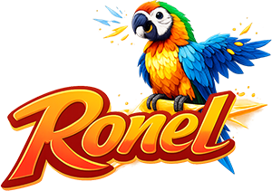

# Ronel

**Ronel** ("Remotely-Operated Native Expression Language") is a simple library and notation framework using HTML-over-the-wire to build native Flutter layouts, created and maintained by Mark Schellhas in 2025.

## Features

Ronel provides a powerful and flexible way to build server-driven UI in Flutter, giving you the speed of web development with the performance of native code.

- **Ship at the Speed of the Web, with Native Power**  
Leverage your existing web app to accelerate development. Ronel embraces the "HTML-over-the-wire" paradigm, where your server remains the single source of truth for your application's views.

- **Choose either single-screen app or tabbed app**
Easy integration into existing and new apps. Create your new app with Ronel, or start replacing screens incrementally.

- **Includes `RonelAuth` for authenticated experiences**
A simple RonelAuth widget will take care of web-based auth screens and token handling for authenticated app experiences.

- Example app in `/example` directory 
Want to see an example? Check out the `/example` directory and run the app there.

## Getting started

Getting started with Ronel is as simple as adding Ronel to your `pubspec.yml` file and calling it in your app.

Add to your project by running `flutter pub add ronel`

## Usage

In you `main.dart` add Ronel to you app's build method:

```dart
const ronelApp = Ronel(
        url: "https://ronel.dev/example",
        appTitle: 'Ronel Example',
        useAutoPlatformDetection: false,
        uiDesign: 'Material',
        appBarColor: Colors.redAccent,
      );
    return ronelApp;
```

## Additional information

Want to get involved? You're warmly invited to open issues and PRs! I'm working on the website and documentation pages as you read this, so stay tuned!
-Mark

---
Copyright (c) 2025 Mark Schellhas. All Rights Reserved.
